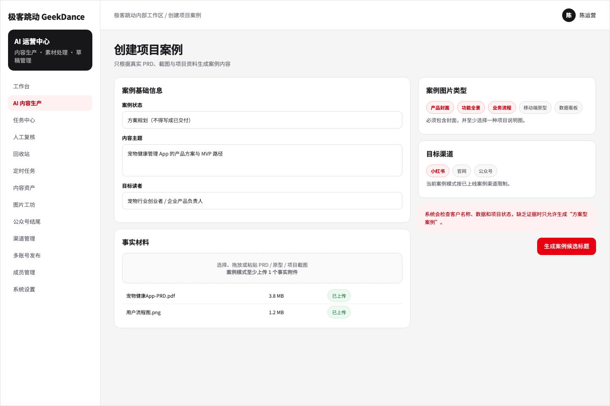

# 极客跳动 AI 运营中心

这是极客跳动团队内部使用的内容运营工作台。它把选题、资料整理、文章生成、配图、人工复核和多渠道投放放在同一条流程里，减少在文档、素材库和各个平台后台之间反复搬运内容的时间。

## 先看产品文档和完整原型

如果你想先了解产品做什么，不需要从代码开始。下面两个入口是这套系统的完整产品说明：

| 入口                                                         | 包含内容                                                                                            |
| ------------------------------------------------------------ | --------------------------------------------------------------------------------------------------- |
| **[查看完整 PRD](docs/PRODUCT.md)**                          | 产品背景、目标用户、完整业务流程、功能模块、渠道规则、异常处理和验收标准                            |
| **[打开完整交互原型](design/aiops-platform-prototype.html)** | 48 个后台页面与状态，覆盖内容生产、人工复核、素材、图片工坊、七渠道、多账号投放、定时任务和系统管理 |
| [查看原型页面索引](design/PROTOTYPE-INDEX.md)                | 按页面编号查找功能，也可以通过 Frame ID 单独打开指定页面                                            |

GitHub 会把 HTML 原型显示为源文件。需要实际操作原型时，下载 `design/aiops-platform-prototype.html` 后用浏览器打开即可。



简单来说，一篇内容会经历这几步：

> 填写主题和资料 → 选择标题 → 生成各渠道版本 → 人工修改与配图 → 保存草稿或受控发布

内容生成后不会绕过复核直接进入渠道。运营人员可以在复核页修改全文、调整封面和插图、预览不同渠道的实际排版，再决定保存草稿或进入发布流程。

## 目前覆盖的渠道

| 渠道         | 内容形态           | 交付方式                         |
| ------------ | ------------------ | -------------------------------- |
| 极客跳动官网 | 官网文章、案例文章 | 服务端写入官网草稿               |
| 微信公众号   | 图文文章           | 微信官方接口写入草稿             |
| 小红书       | 图文笔记           | 浏览器扩展填写并保存草稿         |
| 知乎         | 知乎文章           | 浏览器扩展填写并保存草稿         |
| 今日头条     | 图文文章           | 浏览器扩展填写并保存草稿         |
| 百家号       | 图文文章           | 浏览器扩展填写并保存草稿         |
| LinkedIn     | 长文内容           | 浏览器扩展填写草稿或执行受控投放 |

浏览器渠道复用同事电脑里已经登录的平台账号，不在运营中心保存平台密码、Cookie 或登录态。多账号投放支持草稿与正式发布两种模式；正式发布需要使用已复核内容、明确选择账号并完成二次确认。页面结构、验证码或成功信号不明确时，扩展会停止操作，交给人工处理。

## 日常会用到的功能

- **内容生产**：支持通识、行业、技术、趋势、公司运营和项目案例等内容类型，可上传 PDF、DOCX、TXT、Markdown 和图片资料，并先生成多个标题供选择。
- **渠道差异化写作**：官网、公众号、小红书等渠道使用各自的篇幅、结构和排版规则，不是简单复制同一份正文。
- **人工复核**：在一个完整编辑器里修改文章，在任意位置插入或裁剪图片，并切换查看官网、公众号和其他渠道预览。
- **智能配图**：根据正文判断值得视觉化的位置，生成 4:3 辅助理解型插图；同一篇文章尽量使用不同的信息结构。也可以检索 GeekHome 素材或上传本地图片。
- **封面处理**：公众号可把一张真实图片分别裁成 2.35:1 和 1:1，叠加品牌渐变与 GeekDance 字标后合成组合封面；小红书使用独立的 3:4 封面。
- **公众号结尾**：统一维护关于我们、分割线和精彩推荐，复核时仍可按文章调整。
- **内容资产与图片工坊**：管理、上传和重命名素材，提供透明抠图、人物与背景融合、自由裁剪、自定义 Logo 叠加和封面文字修改等工具。
- **任务与自动化**：查看任务最初填写的全部信息、处理失败任务和回收站；定时任务覆盖七个渠道，并继续经过人工复核。
- **团队与多账号**：每位同事可连接自己的浏览器和平台账号；投放批次逐账号记录结果，单个账号失败不会覆盖其他账号的状态。

## 第一次使用

项目使用 pnpm workspace，包含 Web、API、Worker、共享类型、内容引擎和渠道适配器。

```bash
corepack enable
pnpm install --frozen-lockfile
cp .env.example .env
```

然后只在本机的 `.env` 中填写数据库、Redis 和所需服务配置。不要把真实密钥写进示例文件，也不要提交 `.env`。

本地开发：

```bash
pnpm dev
```

如需按容器方式启动，参考 [Docker Run 启动说明](deploy/README_DOCKER_RUN.md)。生产部署、备份、恢复和健康检查见 [生产部署说明](deploy/README_PRODUCTION.md)。

## 多平台发布扩展

生产构建会生成统一的公司版扩展包：

```text
/downloads/geekdance-multi-platform-draft-uploader.zip
```

同事安装一次即可用于小红书、知乎、今日头条、百家号和 LinkedIn。首次从运营中心执行浏览器渠道任务时，网站会自动完成当前电脑的连接，不需要手工复制令牌或接口地址。

扩展仍依赖平台真实页面，因此平台改版后要重新做 DOM 验收。完整安装和故障处理说明见 [扩展文档](extensions/xiaohongshu-draft-uploader/README.md)。

## 验证

提交前至少运行：

```bash
pnpm typecheck
pnpm test
pnpm build
pnpm test:xhs-extension
```

涉及数据库、队列、渠道状态机或完整流程时，再运行隔离回归：

```bash
pnpm test:isolated
```

本地 Mock 验证只说明代码链路和状态机通过，不能替代真实账号、真实平台页面和生产接口验收。每次部署后仍应分别检查官网草稿、公众号草稿以及各浏览器渠道的填写和保存结果。

## 产品文档和原型

- [完整 PRD](docs/PRODUCT.md)：产品目标、角色、业务流程、功能模块、渠道规则、异常处理与验收标准
- [页面交互说明](docs/PAGE-INTERACTIONS.md)：页面字段、按钮、状态和交互规则
- [项目适配说明](docs/PROJECT-ADAPTATION.md)：业务、品牌、渠道和实现边界
- [完整交互原型](design/aiops-platform-prototype.html)：可直接在浏览器打开，支持通过 `?frame=<Frame ID>` 查看单个页面
- [原型页面索引](design/PROTOTYPE-INDEX.md)：页面编号、用途和评审入口
- [当前项目状态](docs/PROJECT-STATUS.md)：已完成内容、验证证据和仍需真实验收的部分

原型是内部运营后台的完整业务稿，不是营销展示页。它覆盖登录、工作台、内容生产、任务、人工复核、素材、图片工坊、渠道、多账号投放、定时任务、成员、系统设置以及常见加载和错误状态。

## 配置和安全

- 仓库只保留 `.env.example` 与 `.env.production.example`，真实环境变量由部署环境管理。
- 不要提交密码、Cookie、Token、API Key、AccessKey、Secret、客户资料或生产数据库导出。
- 正式渠道操作必须保留操作人、内容版本、目标账号和结果记录。
- 结果不明确时不要自动重试，以免产生重复草稿或重复发布。

如果你只是想了解系统做什么，先看上面的产品文档和原型；如果要本地运行，从 `.env.example` 和 Docker Run 启动说明开始会更直接。
