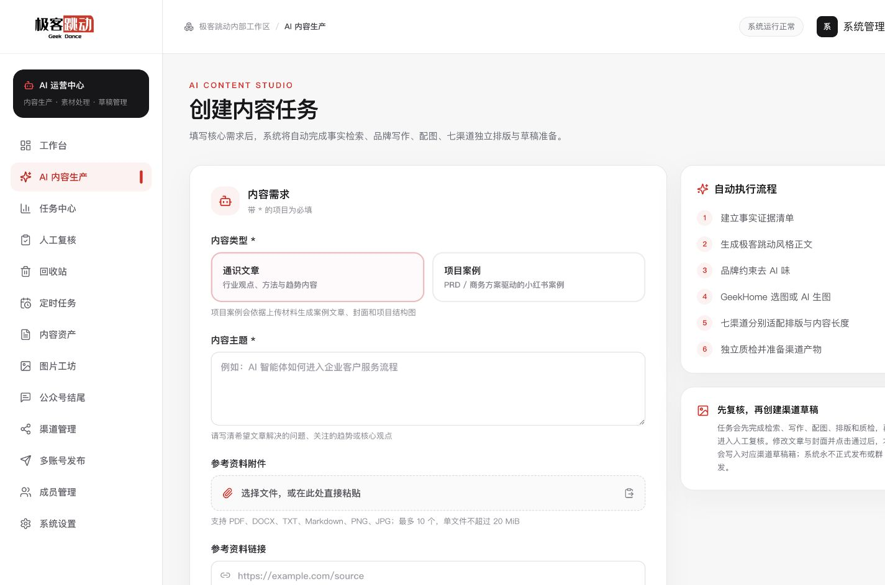
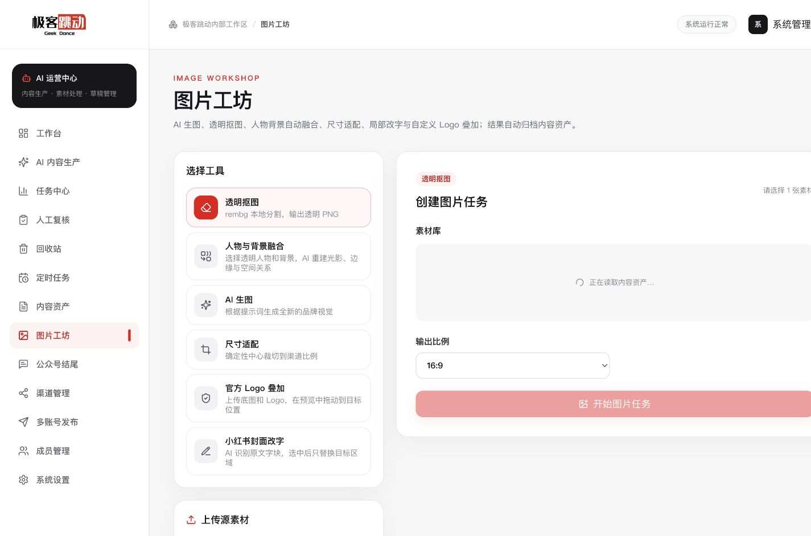
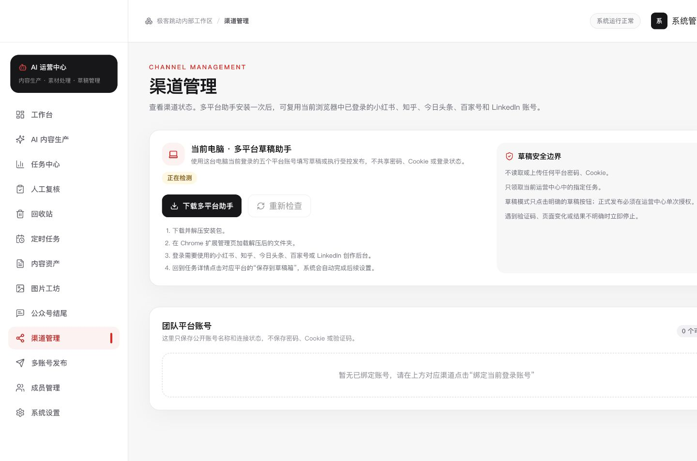
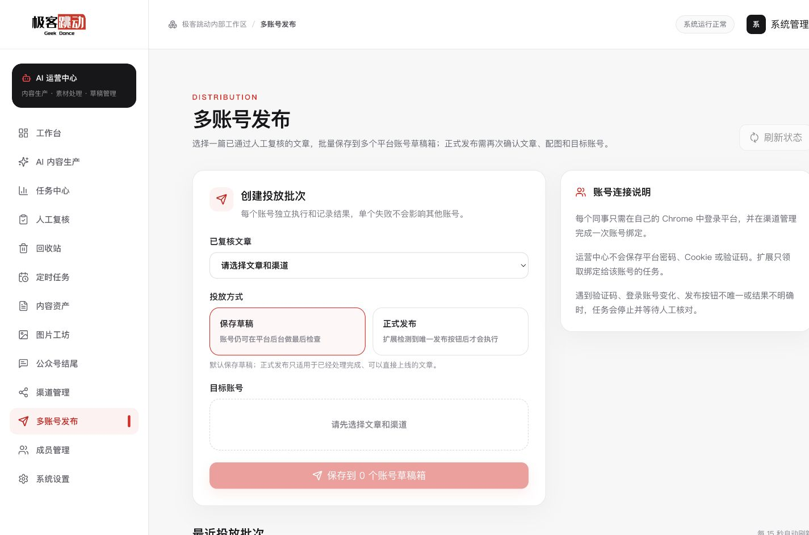
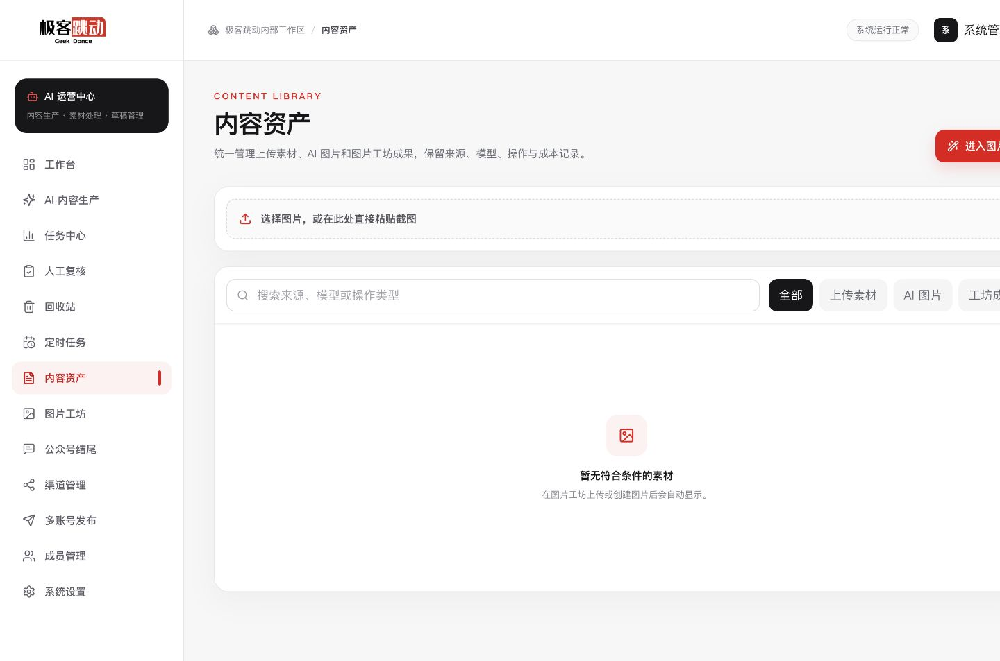
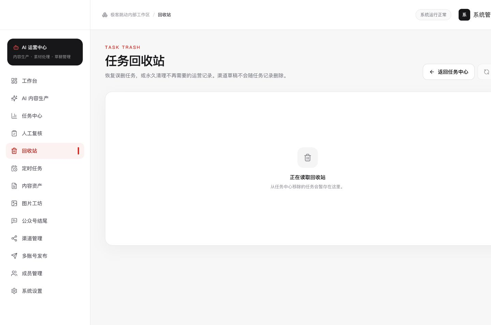
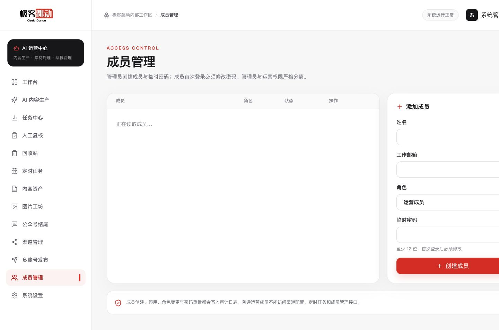
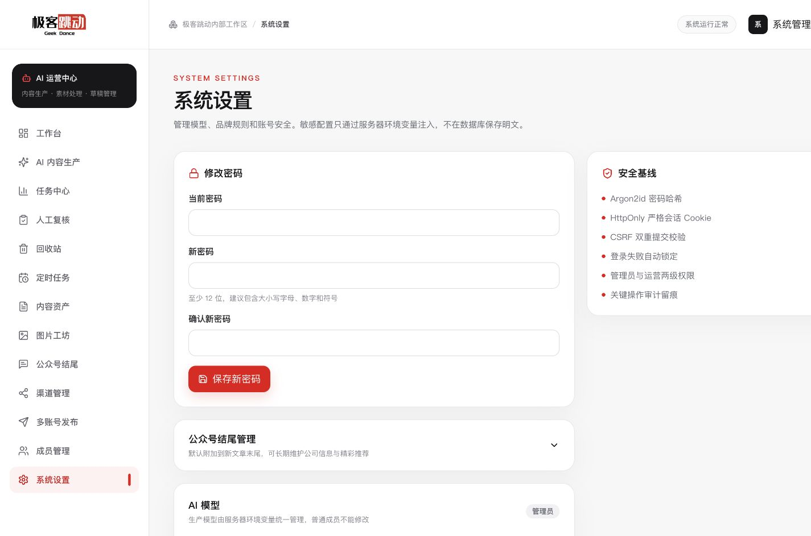
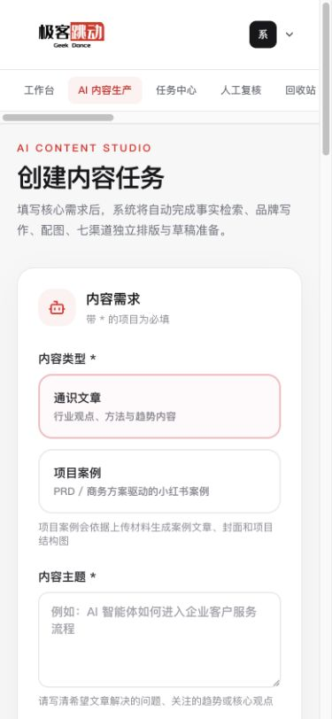

# 真实站点原型（公开脱敏版）

这组原型图来自 2026-08-18 已部署的极客跳动 AI 运营中心。公开版只保留空表单、加载态和不包含真实业务数据的页面，因此可以展示真实界面结构、品牌视觉和响应式效果，同时不暴露任务、成员、账号、联系方式、内部指标或渠道结果。

> 完整生产截图仅用于内部评审，没有进入公开仓库。

## 内容生产

## 图片工坊

## 渠道管理

## 多账号发布

## 内容资产与回收站空态

| 内容资产 | 回收站 |
| --- | --- |
|  |  |

## 成员与系统设置

| 成员管理加载态 | 系统设置 |
| --- | --- |
|  |  |

## 移动端内容生产

## 脱敏规则

- 不上传包含真实任务标题、创建人、任务 ID 或文章正文的截图。
- 不上传真实成员名单、邮箱、账号标识、扩展连接详情或运营指标。
- 不上传电话、地址、Cookie、令牌、API Key、密码、渠道凭据或日志。
- 不对原始截图做模糊遮挡；通过仅选择无敏感信息页面，降低遗漏风险。
