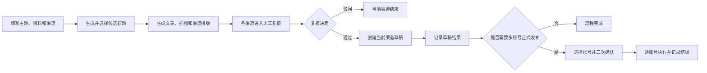

# 极客跳动 AI 运营中心产品需求文档（PRD）

## 1. 文档信息

| 项目 | 内容 |
| --- | --- |
| 产品名称 | 极客跳动 AI 运营中心 |
| 产品版本 | V1.3 七渠道版本 |
| PRD 版本 | V1.3.2-draft |
| 文档日期 | 2026-08-18 |
| 文档状态 | 产品评审稿，待业务确认 |
| 目标读者 | 产品、运营、设计、研发、测试、运维 |
| 需求范围 | 内容生产、AI 配图、人工复核、七渠道草稿、多账号发布、定时任务、素材与系统管理 |

### 1.1 版本记录

| 版本 | 主要变化 | 状态 |
| --- | --- | --- |
| V1.2 | 官网、公众号、小红书、知乎、今日头条、百家号六渠道能力 | 历史基线 |
| V1.3.0 | 增加 LinkedIn、五平台统一扩展、七渠道定时任务和多账号正式发布门禁 | 已完成代码候选 |
| V1.3.1-draft | 将研发型需求清单重写为面向产品评审的常规 PRD | 待确认 |
| V1.3.2-draft | 按产品决策删除公众号群发、定时正式发布和生产表述三条“不做”限制；扩充完整功能原型 | 待确认 |

## 2. 产品概述

### 2.1 产品背景

极客跳动需要持续生产软件定制、AI 产品开发、企业数字化和项目案例类内容。目前内容资料、写作、配图、渠道排版、人工审核和平台草稿分散在不同工具中，运营人员需要反复复制、上传和调整格式，且多人、多账号和外部平台异常难以追踪。

AI 运营中心将完整流程统一到一个后台：运营人员填写主题和资料，系统生成候选标题、文章与图片，运营人员在人工复核中完成最终修改，再将内容保存到各渠道草稿箱；需要正式发布时，必须进入多账号发布模块再次确认。

### 2.2 产品目标

1. 一次填写内容需求，生成适配七个渠道的独立内容。
2. 所有新内容先进入人工复核，避免未经检查直接写入外部平台。
3. 文章、图片、封面和公众号结尾可以在同一个复核页面完成修改和预览。
4. 普通运营人员无需理解 API、令牌、Cookie 或服务器配置。
5. 每个渠道、账号和任务均有独立结果，单点失败不影响其他渠道。
6. 支持多账号草稿和受控正式发布，并保留完整操作记录。

### 2.3 成功标准

| 指标 | 目标 |
| --- | --- |
| 内容任务可追踪率 | 100% 的任务可查看输入、处理阶段、复核和渠道结果 |
| 核心闭环成功率 | 合规任务至少一个目标渠道进入明确终态的比例不低于 95% |
| 重复写入事故 | 结果不明确时自动重试造成的重复草稿或重复发布为 0 |
| 人工复核覆盖 | 新建内容 100% 先进入人工复核 |
| 普通成员配置成本 | 不要求填写扩展令牌、API 地址、Cookie 或平台密码 |
| 操作反馈覆盖 | 上传、生成、保存、发布等异步操作均显示处理中、成功或具体失败 |

### 2.4 本期范围

- 官网、微信公众号、小红书、知乎文章、今日头条图文、百家号图文、LinkedIn 文章七渠道内容生产。
- 候选标题、资料附件、默认补充指令、AI 文章、AI 插图和 GeekHome 素材检索。
- 任务中心、人工复核、连续全文编辑、任意位置插图、裁剪和预览当前修改。
- 公众号组合封面、总结要点、可编辑观察标题和全局文章结尾。
- 内容资产、图片工坊、渠道管理、统一浏览器扩展。
- 多账号草稿、受控正式发布、七渠道定时内容任务。
- 成员、权限、安全、健康检查和操作审计。

### 2.5 本期不做

- 不绕过平台登录、验证码、风控或人工确认。
- 不保存第三方平台密码、Cookie 或浏览器登录态。
- 不删除外部平台已经存在的草稿或正式内容。
- 不在没有事实材料时生成“已经交付”的客户案例。

## 3. 用户与权限

### 3.1 用户角色

| 角色 | 主要职责 | 可操作范围 |
| --- | --- | --- |
| 运营成员 | 创建内容、编辑复核、管理个人素材、保存渠道草稿 | 团队任务可查看；本人扩展连接和账号可管理 |
| 管理员 | 处理全部运营任务、维护成员、定时任务、公众号结尾和渠道健康 | 团队全部数据和管理功能 |
| 系统 Worker | 执行研究、写作、配图、排版和渠道任务 | 只处理队列指定任务 |
| 浏览器扩展 | 使用当前电脑登录态填写平台创作页并回传结果 | 只处理当前连接、当前账号、当前指定任务 |

### 3.2 权限矩阵

| 功能 | 运营成员 | 管理员 |
| --- | --- | --- |
| 创建内容、查看任务 | 可以 | 可以 |
| 编辑、通过或驳回复核 | 可以 | 可以 |
| 管理内容资产 | 本人素材 | 团队素材 |
| 查看公众号结尾 | 可以 | 可以 |
| 修改公众号全局结尾 | 不可以 | 可以 |
| 管理本人扩展和平台账号 | 可以 | 可以 |
| 停用其他成员账号或设备 | 不可以 | 可以 |
| 创建多账号草稿 | 可以 | 可以 |
| 正式发布 | 完成强确认后可以 | 完成强确认后可以 |
| 定时任务、成员管理 | 不可以 | 可以 |

## 4. 产品总体流程

### 4.1 关键原则

- 一次任务可以包含多个渠道，但每个渠道独立生成、复核和保存。
- 一个渠道失败时，其他渠道继续处理，不能整体回滚。
- “一键发布”默认表示保存到草稿箱，不表示公开发布。
- 正式发布只能从多账号发布模块发起，必须确认文章、配图、平台和账号。
- 平台已执行但无法确认结果时标记“结果不明确”，禁止自动重试。

## 5. 产品信息架构

| 一级菜单 | 页面作用 | 主要角色 |
| --- | --- | --- |
| 工作台 | 查看任务、复核、自动化和渠道健康概况 | 全员 |
| AI 内容生产 | 填写需求、生成候选标题并创建任务 | 全员 |
| 任务中心 | 查看任务进度、输入、产物和渠道结果 | 全员 |
| 人工复核 | 集中处理待审核内容 | 全员 |
| 回收站 | 恢复或永久删除内部任务记录 | 全员 |
| 定时任务 | 创建每日自动内容计划 | 管理员 |
| 内容资产 | 上传、搜索、预览和管理图片 | 全员 |
| 图片工坊 | AI 生图和图片处理 | 全员 |
| 公众号结尾 | 维护公众号默认文章结尾 | 管理员编辑、成员只读 |
| 渠道管理 | 管理扩展、设备、平台账号和渠道健康 | 全员 |
| 多账号发布 | 将已复核文章分发到多个平台账号 | 全员 |
| 成员管理 | 创建、编辑、停用成员 | 管理员 |
| 系统设置 | 账号安全和系统运行摘要 | 全员/管理员 |

## 6. 功能详细需求

### 6.1 登录、账号与成员

#### 功能目的

保证只有有效团队成员可以进入系统，并让管理员控制成员角色和状态。

| 功能 | 详细说明 |
| --- | --- |
| 登录 | 使用邮箱和密码登录；错误时不泄露账号是否存在 |
| 首次改密 | 管理员创建成员时设置临时密码，成员首次登录必须修改 |
| 账号菜单 | 点击右上角姓名后显示姓名、邮箱、角色、账号安全和退出 |
| 退出登录 | 点击退出后必须二次确认，避免误操作 |
| 成员管理 | 管理员可创建成员、修改姓名和角色、停用、重置临时密码 |

业务规则：密码至少 12 位；连续 5 次登录失败锁定 15 分钟；会话有效期 12 小时；停用成员或重置密码后现有会话失效；最后一名有效管理员不可停用或降级。

### 6.2 工作台

#### 功能目的

让运营人员快速判断今天需要处理什么、哪些渠道异常。

| 模块 | 显示内容 | 点击结果 |
| --- | --- | --- |
| 今日任务 | 今天创建的任务数、生成中数量 | 进入任务中心并筛选今日 |
| 待人工复核 | 当前待处理数量和最长等待时间 | 进入人工复核待处理列表 |
| 自动化任务 | 已启用数量/全部数量 | 管理员进入定时任务 |
| 可用渠道 | 当前可用渠道数/7 | 进入渠道管理 |
| 最近任务 | 最近 5 个任务、渠道、状态和进度 | 打开任务详情 |
| 渠道健康 | 七渠道可用、需检查、未连接等状态 | 查看对应恢复建议 |

某个指标失败时只显示局部错误；没有任务时引导创建内容；渠道异常必须显示公众号白名单、扩展未连接、账号待验证等真实原因。

### 6.3 AI 内容生产

#### 功能目的

运营人员一次填写内容需求，生成七渠道独立待复核稿。

#### 创建字段

| 字段 | 必填 | 规则与默认值 |
| --- | --- | --- |
| 内容类型 | 是 | 通识文章、项目案例 |
| 内容主题 | 是 | 2–300 字，说明文章要解决的问题 |
| 参考资料附件 | 否；案例必填 | 最多 10 个，单个不超过 20 MiB；支持 PDF、DOCX、TXT、MD、PNG、JPG |
| 参考链接 | 否 | 最多 20 个，仅允许 HTTPS |
| 一级标签 | 否 | 用于内容分类和素材检索 |
| 读者模式 | 是 | 普适模式或专业模式 |
| 图片策略 | 是 | 默认 AI 结构插图；可额外开启 GeekHome 真实素材检索 |
| 补充要求 | 否 | 读取个人默认指令；可编辑并保存为新的个人默认值 |
| 目标渠道 | 是 | 七渠道可多选；案例类型按当前支持渠道限制 |
| 文章标题 | 是 | 从候选标题选择后仍可人工修改 |

#### 候选标题

1. 填写主题、附件、链接、标签、读者模式和补充要求。
2. 点击“生成候选标题”，系统综合全部资料生成 10–20 个标题，默认展示 12 个。
3. 选择一个标题后仍可人工修改；资料发生重要变化时旧候选标记失效。
4. 标题服务失败时允许人工填写，不阻塞内容创建。

| 渠道 | 标题上限 |
| --- | --- |
| 小红书 | 20 字 |
| 微信公众号 | 32 字 |
| 今日头条、百家号 | 30 字 |
| LinkedIn | 120 字符 |
| 官网、知乎 | 120 字 |

多渠道选择时按最严格限制提示，并显示当前字数。

#### 提交后的处理

1. 上传并校验附件，创建任务并返回任务 ID。
2. 研究主题和资料，形成事实证据。
3. 生成品牌文章和 6 张跨渠道复用的 4:3 结构插图。
4. 额外生成小红书 3:4 封面。
5. 分别生成七渠道排版并质检。
6. 成功渠道全部进入人工复核，不直接写入草稿箱。

每名成员最多同时运行 3 个生成任务；等待复核或扩展不占名额。重复提交不能创建两个相同任务。项目案例必须有事实附件，方案型案例不得写成已交付项目。

### 6.4 AI 内容与渠道写作

- 内容面向潜在软件定制客户，说明需求、产品机会、核心流程、MVP 和分阶段交付。
- 不得无依据否定市场，不得虚构客户、数据、成果或交付经历。
- “极客跳动”自然出现在开场、至少一个实施分析段和结尾，不能机械重复。

| 渠道 | 内容侧重点 |
| --- | --- |
| 官网 | 完整、专业、利于搜索和长期阅读 |
| 公众号 | 手机阅读，包含 01/02/03 总结、观察板块和统一结尾 |
| 小红书 | 篇幅较短、节奏轻、重点突出，结尾使用真实话题组件 |
| 知乎 | 解释充分、逻辑完整、回答问题导向 |
| 今日头条 | 信息密度高、开头明确、适合资讯阅读 |
| 百家号 | 结构清楚、观点稳健、适合图文分发 |
| LinkedIn | 行业洞察、方法、业务价值，支持英文或中英双语及 3–5 个标签 |

### 6.5 AI 智能插图

#### 功能目的

自动判断文章中值得增加“辅助理解型插图”的位置，将流程、差异、结构、趋势或关系视觉化，而不是生成无内容的科技场景图。

#### 生成规则

- 一篇普通文章生成 6 张 4:3 横图，跨渠道复用。
- 每张图先确定信息目标，再选择流程、时间轴、对比、层级、矩阵、关系、架构、生态、漏斗或路线图等结构。
- 同一篇文章中同一种构图最多使用一次。
- 白色背景，黑色、深灰和克制红色；右上角固定官方 Logo。
- 标题使用阿里巴巴普惠体 85 Bold，正文使用 55 Regular，字距 0.03em。
- 模型生成无文字底图，程序从正文确定性叠加标题、关键词、序号和结论，降低错字风险。
- 使用 `gpt-image-2` high；失败显示真实错误，不能用空模板冒充。

复核时可按全部、AI、GeekHome、已上传筛选；点击放大；插入光标或指定段落；插入后可裁剪、替换和删除。

### 6.6 任务中心

- 列表可搜索标题、主题或任务 ID，显示创建人、时间、整体进度和七渠道状态。
- 任务详情完整回看内容类型、主题、标题、读者模式、图片策略、渠道、标签、要求、链接、附件和案例配置。
- 生成中显示阶段、百分比和说明；完成后显示渠道文章、证据、复核和草稿结果。
- 取消只停止未执行部分，不删除已生成内容或已有草稿。
- 只重试明确失败的渠道；结果不明确必须先到平台人工核对。

### 6.7 人工复核

#### 页面布局

- 左侧为连续全文编辑区，占主要宽度，不把文章拆成大量卡片。
- 右侧在“智能配图”和“预览当前修改”之间切换。
- 证据、渠道结果和复核历史位于页面下方。
- 打开页面立即显示当前渠道正文，不要求再次点击预览。

#### 可编辑内容

| 内容 | 操作 |
| --- | --- |
| 标题和正文 | 直接修改；输入区随内容增高；Enter 正常换行 |
| 公众号总结 | 修改 01、02、03 三个要点 |
| 观察板块标题 | “极客跳动观察”可改成其他文字 |
| 正文图片 | 上传、粘贴、选择 AI/GeekHome/资产图片、插入、裁剪、替换、删除 |
| 小红书图片 | 调整封面和组图顺序，不使用正文锚点 |
| 公众号封面 | 上传真实图、调整两种裁剪、预览最终拼图 |
| 公众号结尾 | 查看当前任务保存的结尾快照 |

点击“预览当前修改”后保存复核稿、重新生成渠道 HTML 并刷新预览；按钮显示生成中、成功时间或具体失败。

“通过并保存到草稿箱”和“驳回”只处理当前渠道。多人同时提交同一复核时只允许第一笔成功，其他人收到冲突提示。

### 6.8 公众号封面

真实封面素材只在公众号人工复核中上传，不放在内容生产中，也不用于官网封面。

1. 上传一张真实图片。
2. 立即生成 2.35:1 首图和 1:1 次图两个可拖动、缩放的裁剪框。
3. 两部分顶部都叠加最高透明度 50% 的淡红渐变。
4. GeekDance 字标位于顶部并横向铺开，与图片融合。
5. 合成为 900×1283 的一张组合图并立即刷新复核预览。

大图在浏览器端压缩后上传，最长边不超过 2400px。失败反馈必须区分文件过大、格式、iCloud 未下载、服务器、存储或真实网络问题；本地保存成功后不等待慢速 OSS 镜像，避免误报 524。

### 6.9 公众号正文与默认结尾

- 手机预览的字号、段前段后和多行行距保持一致。
- 总结区域显示 01、02、03，并同步人工修改。
- 观察标题可编辑；文章结尾前有分割线；末尾不强制添加标点。

管理员可长期维护以下结尾字段：

| 字段 | 规则 |
| --- | --- |
| 关于我们介绍 | 支持多行，保持固定排版和行距 |
| 品牌口号 | 可编辑，末尾不强制标点 |
| 电话、网站、地址 | 分字段维护 |
| 服务能力 | 1–6 条 |
| 精彩推荐 | 0–3 条，包含文章名称和 HTTPS 链接 |

任务创建时保存结尾快照，之后修改全局结尾不会改变历史任务和草稿。

### 6.10 内容资产

- 支持文件选择、拖放和直接粘贴上传；每个文件显示独立进度和结果。
- 支持搜索、来源/类型筛选、放大、重命名和删除。
- 显示名称、缩略图、来源、尺寸、格式和创建时间。
- 重命名不改变卡片高度或字体大小，编辑/保存/取消/删除按钮等宽对齐。
- 删除需二次确认，只删除内部资产，不删除外部平台已使用图片。

### 6.11 图片工坊

| 工具 | 输入 | 输出与操作 |
| --- | --- | --- |
| AI 生图 | 图片要求 | 生成图片并加入内容资产 |
| 透明抠图 | 一张源图 | 透明背景 PNG |
| 人物与背景融合 | 人物图、背景图、可选要求 | 自动匹配位置、大小、透视和光线 |
| 手动裁剪 | 一张图片 | 拖动裁剪边框并导出 |
| 尺寸适配 | 图片、目标尺寸 | 指定比例图片 |
| 官方 Logo 叠加 | 底图、自定义透明 Logo | 在预览中拖动位置并调整宽度 |
| 小红书封面改字 | 封面图、新文字 | 识别文字区域，选择并微调后局部替换 |
| 公众号封面品牌化 | 一张真实图 | 带渐变和 GeekDance 字标的组合封面 |

“精确拼接”和“AI 创意拼接”已经删除，不得重新出现。上传、识别、生成和加入素材库均需显示处理中、成功或具体失败。

### 6.12 回收站

- 可恢复任务或二次确认后永久删除内部记录。
- 删除内部任务不删除官网、公众号或其他平台已有草稿。

### 6.13 官网与公众号草稿

| 渠道 | 通过复核后的处理 | 失败处理 |
| --- | --- | --- |
| 官网 | 通过 CMS 接口创建草稿，展示草稿 ID 或编辑地址 | 只标记官网失败，保留复核稿 |
| 公众号 | 上传正文图片和最终封面后创建草稿 | 提示 API 权限、白名单或接口错误 |

公众号必须使用复核页面最终确认的组合封面、正文、总结和结尾快照。本期不执行公众号群发。

### 6.14 浏览器渠道与统一扩展

一份“极客跳动多平台草稿助手”扩展支持小红书、知乎、今日头条、百家号和 LinkedIn。

#### 成员操作流程

1. 在渠道管理下载并安装扩展，在平台网页正常登录。
2. 在运营中心选择已复核任务；系统自动建立成员与当前电脑连接，不要求令牌。
3. 扩展领取指定任务，核对平台和当前账号，下载图片并填写创作页。
4. 草稿按钮和成功信号明确时保存并回传；否则停下交给用户人工确认。

| 平台 | V1 内容 | 默认完成方式 |
| --- | --- | --- |
| 小红书 | 图文笔记 | 自动上传填写，人工点击“暂存离开” |
| 知乎 | 知乎文章 | 唯一草稿按钮明确时保存，否则人工接管 |
| 今日头条 | 图文文章 | 唯一草稿按钮明确时保存，否则人工接管 |
| 百家号 | 图文文章 | 唯一草稿按钮明确时保存，否则人工接管 |
| LinkedIn | 图文文章 | 草稿或受控正式发布；不明确时人工核对 |

未登录、验证码、账号不一致、页面变化、按钮不唯一或无法确认成功时，扩展必须安全停止，不能猜测按钮或反复点击。

### 6.15 渠道管理

- “当前电脑”显示扩展未安装、版本过旧、未连接、已连接或已过期，并提供下载、检查和重连。
- “平台账号”显示平台、账号、成员、电脑、最近在线和状态。
- “渠道健康”同时检查七渠道服务配置和当前电脑可用性，不能用其他电脑的连接冒充当前电脑可用。
- 成员只管理本人设备与账号；管理员可停用团队账号。
- 页面不显示令牌、API 地址、Cookie 或密码。

### 6.16 多账号发布

#### 使用前提

- 文章已经人工复核；每个账号在独立 Chrome 配置文件或电脑登录并绑定。
- 一个批次只对应一个渠道和一种模式。

| 字段 | 说明 |
| --- | --- |
| 已复核文章 | 只显示存在可用渠道产物的文章 |
| 平台 | 小红书、知乎、头条、百家号或 LinkedIn |
| 目标账号 | 支持多选 |
| 模式 | 保存草稿、正式发布 |

正式发布时展示文章、平台和全部账号；操作者必须确认文章与配图并完整输入标题。系统冻结内容指纹、账号清单、确认人和时间；文章修改后旧授权失效。

每个账号独立显示等待扩展、上传、已填写、已保存/已发布、失败或结果不明确。单账号失败不影响其他账号；结果不明确时先去平台核对，不提供直接重试。

### 6.17 定时任务

管理员配置每日固定时间的内容模板：任务名称、时间、主题、标题、读者模式、链接、图片策略、标签、补充要求和目标渠道。渠道可以选择全部七个，时区固定 Asia/Shanghai。

- 新建计划默认停用；启用或立即运行前检查 Worker 和渠道能力。
- 同一计划同一时间点只运行一次。
- 运行后只生成七渠道复核稿，不创建外部草稿，不正式发布。
- 复核通过后走普通草稿流程；需要正式发布时转入多账号发布重新确认。

### 6.18 系统设置与审计

- 全员可以修改自己的密码。
- 管理员可查看模型、品牌、渠道和存储的“已配置/未配置”摘要，不能看密钥明文。
- 健康状态区分 Worker 离线、密钥缺失、生产开关关闭、扩展未连接、版本不一致和存储异常。
- 登录、复核、删除、成员变更、渠道绑定和正式发布记录操作者、动作、对象、结果和时间。
- 审计日志不记录密码、Cookie、Token、API Key、文章全文或客户私密附件。

## 7. 核心状态与用户反馈

| 状态 | 用户含义 | 可执行操作 |
| --- | --- | --- |
| 排队中/生成中 | 系统正在研究、写作、配图或排版 | 查看进度、取消未执行部分 |
| 待人工复核 | 至少一个渠道等待审核 | 进入复核 |
| 等待扩展 | 浏览器渠道等待当前电脑领取 | 检查扩展和登录 |
| 等待人工暂存 | 内容已填写，需要在平台点击暂存 | 打开平台完成 |
| 草稿完成 | 当前渠道已确认创建草稿 | 查看草稿结果 |
| 部分完成 | 部分渠道成功、部分失败 | 重试明确失败项 |
| 失败 | 有明确错误且未完成 | 查看原因和恢复动作 |
| 结果不明确 | 已执行但无法确认平台结果 | 先人工核对，不自动重试 |

所有异步按钮点击后立即显示处理中并禁用重复点击；字段错误、上传错误就近显示；成功提示说明具体完成内容；错误说明真实原因和下一步。页面覆盖加载、空、错误、无权限、禁用、确认和成功状态。

## 8. 产品级数据对象

| 对象 | 主要内容 | 生命周期 |
| --- | --- | --- |
| 内容任务 | 创建输入、创建人、整体状态、进度 | 创建至删除或归档 |
| 渠道产物 | 渠道文章、排版、图片、状态和结果 | 按渠道独立变化 |
| 人工复核 | 当前稿、修改记录、决定人和时间 | 待处理至通过/驳回/核对 |
| 内容资产 | 名称、来源、格式、尺寸、存储和归属 | 上传/生成至软删除 |
| 扩展连接 | 成员、电脑、版本、状态和最后在线 | 连接至过期或撤销 |
| 平台账号 | 平台、公开账号名、连接和成员 | 绑定至停用 |
| 发布批次 | 文章、平台、模式、账号和结果 | 创建至明确终态 |
| 定时计划 | 模板、时间、渠道和启用状态 | 创建至停用/删除 |
| 公众号结尾 | 全局配置和任务快照 | 更新后历史快照保留 |

## 9. 非功能需求

| 类别 | 要求 |
| --- | --- |
| 性能 | 创建任务 2 秒内返回已受理；图片和外部平台操作异步执行 |
| 容量 | 每成员最多 3 个生成任务、5 台电脑；附件最多 10×20 MiB |
| 可用性 | 局部接口失败不导致整页不可用；离页后任务继续运行 |
| 兼容性 | 当前 Chrome 稳定版；桌面 1440px 和移动 390px |
| 可访问性 | 正文对比度不低于 4.5:1；焦点可见；移动点击区不小于 44px |
| 安全 | 密码加密、CSRF、HttpOnly Session、速率限制、权限、幂等和审计 |
| 隐私 | 平台登录态只在用户本机；日志不记录正文和凭据 |
| 可恢复 | 上传、生成、复核、渠道和扩展均有失败原因及恢复动作 |
| 发布安全 | 草稿优先；正式发布需要内容指纹、账号清单和二次确认 |

## 10. 第三方依赖与降级

| 依赖 | 用途 | 不可用时的处理 |
| --- | --- | --- |
| OpenAI/OpenRouter 文本模型 | 研究与写作 | 任务失败并显示真实错误，不生成伪内容 |
| OpenAI gpt-image-2 | AI 插图底图 | 图片失败，保留文章和其他图片 |
| GeekHome | 真实素材检索 | 保留 AI 插图和人工上传路径 |
| 官网 CMS | 官网草稿 | 只标记官网失败并支持人工核对 |
| 微信 API | 素材与公众号草稿 | 保留复核稿，提示权限、白名单或接口错误 |
| Chrome 扩展 | 五个平台创作页 | 显示安装、登录、版本或页面恢复建议 |
| PostgreSQL/Redis | 数据与队列 | 健康失败时拒绝新任务，避免丢失 |
| 本地存储/OSS | 附件和图片 | 本地先保存，镜像同步后台执行 |

## 11. 验收清单

### 11.1 内容生产

- [ ] 填写主题、资料和渠道后可生成 12 个候选标题并选择。
- [ ] 提交后不会直接写入任何渠道草稿箱。
- [ ] 七渠道分别生成产物，单渠道失败不影响其他渠道。
- [ ] 任务详情可回看创建时填写的全部内容。

### 11.2 复核与图片

- [ ] 打开复核立即显示正文，标题和红框正文支持 Enter 换行和自适应高度。
- [ ] 图片可从 AI、GeekHome、上传和内容资产选择，并插入任意位置。
- [ ] 预览当前修改与编辑内容一致。
- [ ] 公众号 01/02/03、观察标题、封面和结尾修改均进入最终草稿。
- [ ] 上传一张公众号图片后可调整 2.35:1 与 1:1 裁剪并预览组合图。

### 11.3 渠道与扩展

- [ ] 官网与公众号复核通过后只创建草稿，不正式发布。
- [ ] 同一扩展支持小红书、知乎、头条、百家号和 LinkedIn。
- [ ] 同事电脑无需填写令牌即可连接和绑定账号。
- [ ] 账号不一致、验证码或页面变化时扩展安全停止。
- [ ] 结果不明确时系统不会自动重复写入。

### 11.4 多账号、定时任务和权限

- [ ] 一篇已复核文章可选择同平台多个账号保存草稿。
- [ ] 正式发布必须确认配图并输入完整标题，内容修改后旧确认失效。
- [ ] 单账号失败不影响其他账号。
- [ ] 定时任务可选择七渠道，但只生成待复核稿。
- [ ] 普通成员不能修改全局公众号结尾或管理员功能。
- [ ] 删除内部任务不会删除外部平台草稿。

## 12. 版本规划与上线条件

| 版本 | 主要范围 | 上线条件 |
| --- | --- | --- |
| V1.3 | 七渠道、五平台扩展、人工复核、多账号、定时任务 | 构建和回归通过；部署后逐渠道真实账号验收 |
| V1.4 | 资产去重、结尾版本、运营数据分析 | 基于 V1.3 真实使用数据评审 |

V1.3 当前只能说明本地代码候选和原型已完成。LinkedIn 真实页面、五个平台账号识别、草稿按钮、正式发布成功信号、官网 CMS 和公众号生产接口仍需部署环境与真实账号逐项验收后，才能标记为生产可用。

## 13. 术语说明

| 术语 | 含义 |
| --- | --- |
| 内容任务 | 一次从主题和资料生成一个或多个渠道内容的任务 |
| 渠道产物 | 某个渠道独立的文章、排版、图片和结果 |
| 人工复核 | 运营人员修改单渠道内容并决定通过或驳回 |
| 一键发布 | 默认指将已复核内容写入渠道草稿箱 |
| 正式发布 | 将内容直接公开，必须经过多账号发布强确认 |
| 浏览器渠道 | 依赖本机登录态和扩展的五个平台 |
| 结果不明确 | 已执行平台操作，但无法唯一确认是否成功 |

## 14. P1 产品评审

- [x] 产品背景、目标、用户、范围和不做项已写明。
- [x] 18 个主要功能模块已按用户操作路径展开。
- [x] 七渠道差异、草稿与正式发布边界已写明。
- [x] 正常流程、异常反馈、权限和核心验收已覆盖。
- [ ] 运营负责人确认功能描述与实际工作方式一致。
- [ ] 产品负责人确认 V1.3.2 为新的 PRD 基线。
